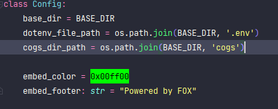

# Fox bot


#### Author - https://github.com/saaasuuukaae/
#### My discord - А я Ята#7777(686207718822117463)


# Requirements
> Python 3.10.6

# How to start
> pip install -r r.modules.txt

> edit the .env file. (Instructions in the 2. .env section)

> edit the data.json file (Instructions in the 1. data.json section)

> python main.py

## 1. How to edit data.json

### by fields

> enabled: true

```
    If enabled is true - bot will work.
    If enabled is false - bot will not work.
```

> send_embed: true

```
    If send_embed is true - bot will send embed message.
    If send_embed is false - bot will send message without any styling.
```

> guilds: []

```
Each instance in guilds list should contain next fields:
    - id: int - id of guild
    - channels: list[int] - list of channels
        - id: int - id of channel
```

> root_guild

```
    -id: int - id of the root guild
    root_channels: list[int] - list of the channels in the root guild from which bot will send messages
        - id: int - id of the channel
    root_users: list[int] - list of the users that can user /toggle and /toggle-embed commands.
        - id: int - id of the user    
        
    P.S. if user that sends the message in one of the root_channels not in 
    the root_users list - bot'll not send message.
```

## 2. .env

### by fields

> TOKEN=

```
    Put after = your bot token.(WITHOUT SPACES, WITHOUT < >, WITHOUT ", WITHOUT ')
```

### _config.py file

### by fields

> base_dir is the path to the directory with the bot main file (and .env). 

> dotenv_file_path is the path to the .env file.

> cogs_dir_path is the path to the directory with the cogs.

> embed_color = is the hex color of the embed message.
```
    If you want to change the color of the embed message - change the value of the variable.
    Default value is #00ff00.
    
    Also if you want use rgb color: 
    - type **import disnake** on top of the file.
    - change the value of the variable to:
    ```
        embed_color = disnake.Color.from_rgb(0, 255, 0)
    ```
```
> embed_footer is the text of the footer of the embed message.


